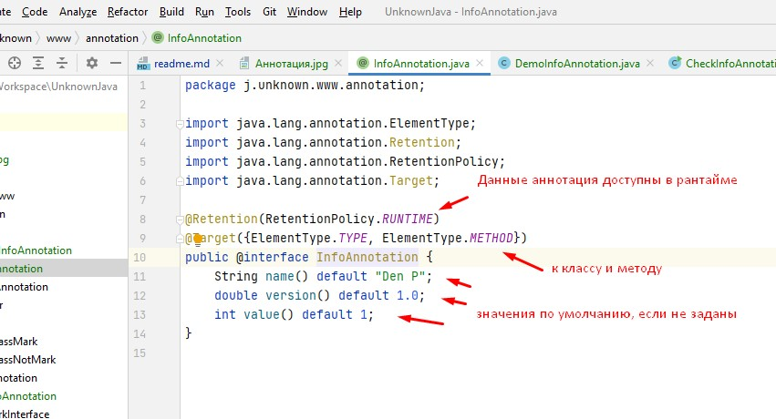

# Изучение или повторение JAVA 

# Аннотации
 - #### [1. Маркерный интерфейс](#1-маркерный-интерфейс-1)
 - #### [1.3 Ключевые моменты](#13-ключевые-моменты-1)
 - #### [2. Анатомия аннотации](#2-анатомия-аннотации-1)
 - #### [3. Классификация аннотаций](#3-классификация-аннотаций-1)
 - #### [4. Аннотации для аннотаций](#4-аннотации-для-аннотаций)

### 1. Маркерный интерфейс

Предшественники аннотаций JAVA это маркерные клaссы, такие как Serializable, Cloneable.
``` java
public class Foo implements MarkerInterface {} //(1)

@MyAnnotation 
public class Foo {} //(2)

```

1 - маркерный интерфейс
2 - аннотация, как эквивалент маркерного класса

1. #### Интерфейсы определяют тип ##
   Маркерный интерфейс отмечает объект, реализующий какой либо тип и это исключает ошибки на этапе компиляции.
   [Пример с маркерными интерфейсами](/src/j/unknown/www/CheckMarkInterface.java "Нажми чтобы открыть")
   
2. #### Интерфейс определяет тип для наследников класса
   Если класс реализует интерфейс, то и все наследники будут реализовывать этот интерфейс. **Нельзя отвязать интерфейс от наследников**. Для "отсоединения" применяют аннотации. Минус - проверка наличия аннотации проводится на этапе выполнения, а это может привести к ошибкам
   [Пример с аннотациями](/src/j/unknown/www/CheckAnnotation.java "Нажми чтобы открыть").
   При вызове testAnnotation(child) возникает исключение, что класс не помечен аннотацией, и об этом мы узнаем только на этапе выполнения программы. Если в аннотацию, добавить аннотацию @Inherited, то ошибки во время выполнения программы не будет. Child класс также наследует аннотацию MarkAnnotation, которая определена у Parent.
   
3. #### 1.3 Ключевые моменты
   Если необходимо знать могут ли какие либо методы принимать определенные классы, необходимо применять маркерные интерфейсы. В этом случае на этапе компиляции обнаружим ошибку
   Если необходимо провести анализ метаданных класса, тогда применяем аннотации, но проверить можно только во время выполнения программы
   
### 2. Анатомия аннотации
   Базовое определение аннотации выглядит следующим образом
   
   ~~~ java
   @Retention(RetentionPolicy.RUNTIME)
   @Target(ElementType.TYPE)
   @Inherited
   @Documented
   public @interface MyAnnotation {
      String name() default "";
      int value();
   }
   ~~~
Кажется, что какая-то непонятная херобора, рассмотрим детальнее

- **@Retention**: доступность аннотации. Аннотация может быть доступна в исходнике, классе, на этапе выполнения
- **@Target**: для какого элемента ее можно использовать (поле, класс, пакет и тд)
- **@Inherited**: позволяет реализовать наследование аннотаций родительского класса классом-наследником
- **@Documented:** аннотация будет помещена в сгенерированную документацию javadoc
- **@interface:** сообщает о том, что это аннотация

Аннотация может содержать параметры, в данном случае это String и int



[Пример аннотации с параметрами](/src/j/unknown/www/CheckInfoAnnotation.java "Кликай, не спи")

### 3. Классификация аннотаций

Аннотации бывают:
- аннотации для аннотаций ( масло для масла ;) )
- аннотации типов
- аннотации для кода
- нативные аннотации
- аннотации, написанные программистом

Далее подробно

### 4. Аннотации для аннотаций

**Аннотации для аннотаций** еще называют мета-аннотациями. (масло для масла - это метамасло ;))

Таких аннотаций 5 штук:
- **@Target:** указывает контекст для которого применима аннотация
- **@Retention:** указывает до какого шага компиляции, аннотация будет доступна
- **@Document:** указывает, что аннотация должна быть задокументированна с помощью javadoc
- **@Inherited:** позволяет реализовать наследование аннотаций родительского класса, классом-наследником
- **@Repetable:** аннотация может быть использована повторно в том же месте

### 4.1 Аннотация @Target
``` java
@Documented
@Retention(RetentionPolicy.RUNTIME)
@Target(ElementType.ANNOTATION_TYPE)
public @interface Target {
    /**
     * Returns an array of the kinds of elements an annotation type
     * can be applied to.
     * @return an array of the kinds of elements an annotation type
     * can be applied to
     */
    ElementType[] value();
}
```

Для аннотации @Target применена мета-аннотация @Target :)


