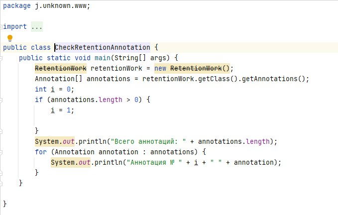
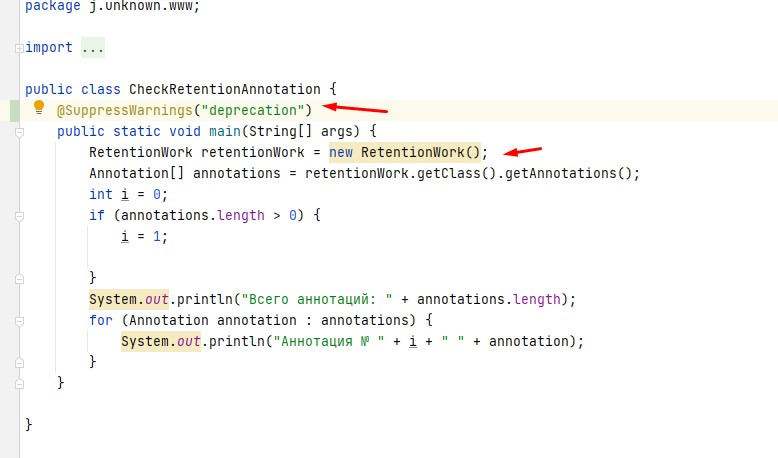

# Изучение или повторение JAVA 

# Аннотации
 - #### [1. Маркерный интерфейс](#1-маркерный-интерфейс-1)
 - #### [1.3 Ключевые моменты](#13-ключевые-моменты-1)
 - #### [2. Анатомия аннотации](#2-анатомия-аннотации-1)
 - #### [3. Классификация аннотаций](#3-классификация-аннотаций-1)
 - #### [4. Аннотации для аннотаций](#4-аннотации-для-аннотаций-1)
 - #### [4.1. Аннотация @Target](#41-аннотация-target-1)
 - #### [4.2 Аннотация @Retention](#42-аннотация-retention-1)
 - #### [4.3 Аннотация @Documented](#43-аннотация-documented-1)
 - #### [4.4 Аннотация @Inherited](#44-аннотация-inherited-1)
 - #### [4.5 Аннотация @Repeatable](#45-аннотация-repeatable-1)
 - #### [5. Аннотации для кода](#5-aннотации-для-кода-1)
 - #### [5.1 Аннотация @Override](#51-аннотация-override)
 - #### [5.2 Аннотация @Deprecated](#52-аннотация-deprecated)
 - #### [5.3 Аннотация @SuppressWarnings](#53-аннотация-suppressWarnings-1)
 - #### [5.4 Аннотация @SafeVarargs](#54-аннотация-safeVarargs-1)
 - #### [5.5 Аннотация @FunctionalInterface](#55-аннотация-functionalInterface-1)
 - #### [6. Аннотация @Native](#6-аннотация-native)

### 1. Маркерный интерфейс

Предшественники аннотаций JAVA это маркерные клaссы, такие как Serializable, Cloneable.
```java
public class Foo implements MarkerInterface {} //(1)

@MyAnnotation 
public class Foo {} //(2)

```

1 - маркерный интерфейс
2 - аннотация, как эквивалент маркерного класса

1. #### Интерфейсы определяют тип ##
   Маркерный интерфейс отмечает объект, реализующий какой либо тип и это исключает ошибки на этапе компиляции.
   [Пример с маркерными интерфейсами](/src/j/unknown/www/CheckMark.java "Нажми чтобы открыть")
   
2. #### Интерфейс определяет тип для наследников класса
   Если класс реализует интерфейс, то и все наследники будут реализовывать этот интерфейс. **Нельзя отвязать интерфейс от наследников**. Для "отсоединения" применяют аннотации. Минус - проверка наличия аннотации проводится на этапе выполнения, а это может привести к ошибкам
   [Пример с аннотациями](/src/j/unknown/www/CheckAnnotation.java "Нажми чтобы открыть").
   При вызове testAnnotation(child) возникает исключение, что класс не помечен аннотацией, и об этом мы узнаем только на этапе выполнения программы. Если в аннотацию, добавить аннотацию @Inherited, то ошибки во время выполнения программы не будет. Child класс также наследует аннотацию MarkAnnotation, которая определена у Parent.
   
3. #### 1.3 Ключевые моменты
   Если необходимо знать могут ли какие либо методы принимать определенные классы, необходимо применять маркерные интерфейсы. В этом случае на этапе компиляции обнаружим ошибку
   Если необходимо провести анализ метаданных класса, тогда применяем аннотации, но проверить можно только во время выполнения программы
   
### 2. Анатомия аннотации
   Базовое определение аннотации выглядит следующим образом
   
   ~~~java
   @Retention(RetentionPolicy.RUNTIME)
   @Target(ElementType.TYPE)
   @Inherited
   @Documented
   public @interface MyAnnotation {
      String name() default "";
      int value();
   }
   ~~~
Кажется, что какая-то непонятная херобора, рассмотрим детальнее

- **@Retention**: доступность аннотации. Аннотация может быть доступна в исходнике, классе, на этапе выполнения
- **@Target**: для какого элемента ее можно использовать (поле, класс, пакет и тд)
- **@Inherited**: позволяет реализовать наследование аннотаций родительского класса классом-наследником
- **@Documented:** аннотация будет помещена в сгенерированную документацию javadoc
- **@interface:** сообщает о том, что это аннотация

Аннотация может содержать параметры, в данном случае это String и int


[Пример аннотации с параметрами](/src/j/unknown/www/CheckInfoAnnotation.java "Кликай, не спи")

### 3. Классификация аннотаций

Аннотации бывают:
- аннотации для аннотаций ( масло для масла ;) )
- аннотации типов
- аннотации для кода
- нативные аннотации
- аннотации, написанные программистом

Далее подробно

### 4. Аннотации для аннотаций

**Аннотации для аннотаций** еще называют мета-аннотациями. (масло для масла - это метамасло ;))

Таких аннотаций 5 штук:
- **@Target:** указывает контекст для которого применима аннотация
- **@Retention:** указывает до какого шага компиляции, аннотация будет доступна
- **@Document:** указывает, что аннотация должна быть задокументированна с помощью javadoc
- **@Inherited:** позволяет реализовать наследование аннотаций родительского класса, классом-наследником
- **@Repetable:** аннотация может быть использована повторно в том же месте

### 4.1 Аннотация @Target
```java
@Documented
@Retention(RetentionPolicy.RUNTIME)
@Target(ElementType.ANNOTATION_TYPE)
public @interface Target {
    /**
     * Returns an array of the kinds of elements an annotation type
     * can be applied to.
     * @return an array of the kinds of elements an annotation type
     * can be applied to
     */
    ElementType[] value();
}
```

Для аннотации @Target применена мета-аннотация @Target :)

Аннотация определяет место( контекст ), где аннотация может быть применена.

Контексты:
- **ElementType.ANNOTATION_TYPE:** применяется для определения другой аннотации
- **ElementType.CONSTRUCTOR:** применяется для определения конструктора
- **ElementType.FIELD:** применяется для определения поля, включая константы Enum
- **ElementType.LOCAL_VARIABLE:** применяется для определения локальной переменной
- **ElementType.METHOD:** применяется для определения метода
- **ElementType.MODULE:** применяется для определения модуля (с Java 9)
- **ElementType.PACKAGE:** применяется для определения пакета
- **ElementType.PARAMETER:** применяется для определения параметра
- **ElementType.TYPE:** применяется для определения класса, интерфейса (включая аннотируемый тип), Enum или record.
- **ElementType.TYPE_PARAMETER:** применяется для определения типа параметра (с Java 8)
- **ElementType.TYPE_USE:** применяется для определения используемого типа (с Java 8)
- **ElementType.RECORD_COMPONENT:** ассоциируется с records как компонент записи (с Java 14)

[Пример с @Target на одном классе](/src/j/unknown/www/types/TargetContext.java "Кликай")

Не получилось применить ElementType.PACKAGE. 
~~~java
@Target(ElementType.PACKAGE)
public @interface PackageContext {
}
~~~

### 4.2 Аннотация @Retention
~~~java
@Documented
@Retention(RetentionPolicy.RUNTIME)
@Target(ElementType.ANNOTATION_TYPE)
public @interface Retention{    
}
~~~

Аннотация определяет до какого шага компиляции аннотация будет доступна.

Возможные шаги (политики):
1. **RetentionPolicy.SOURCE:** аннотация сохраняется только в исходном файле и удаляется во время компиляции
2. **RetentionPolicy.CLASS:** аннотация сохраняется в файле .class во время компиляции, но недоступна во время выполнения через JVM
3. **RetentionPolicy.RUNTIME:** аннотация сохраняется в файле .class во время компиляции и доступна через JVM во время выполнения

По умолчанию, в случае отсутствия @Retention, применяется политика RetentionPolicy.CLASS.

Определим аннотацию

```java
@Retention(RetentionPolicy.SOURCE)
public @interface RetentionAnnotation {
}
```
Пометим класс двумя аннотациями

```java
@RetentionAnnotation
@Deprecated(since = "15",forRemoval = false)
public class RetentionWork {
}
```

Аннотация после компиляции @RetentionAnnotation не будет доступна через JVM, потому что политика удержания действует только на исходный код.

На этапе компиляцц будет доступна только аннотация @Deprecated

[Пример с политикой удержания](/src/j/unknown/www/CheckRetentionAnnotation.java)

### 4.3 Аннотация @Documented

```java
@Documented
@Retention(RetentionPolicy.RUNTIME)
@Target(ElementType.ANNOTATION_TYPE)
public @interface Documented{}
```

По умолчанию аннотации не включаются в javadoc. Чтобы это произошло, необходимо добавить аннотацию @Documented
[Пример применения аннотации](/src/j/unknown/www/CheckDocument.java)
[Результат документации(IntellijIdea: Tools -> Generate JavaDoc…)](/resources/Document.jpg)


### 4.4 Аннотация @Inherited

~~~java
@Documented
@Retention(RetentionPolicy.RUNTIME)
@Target(ElementType.ANNOTATION_TYPE)
public @interface Inherited{}
~~~

Если мы хотим, чтобы аннотации также наследовались, родительский класс необходимо пометить аннотацией @Inherited: в этом случае все аннотации родительского класса будут применимы к наследникам.
[Пример наследования аннотаций.](/src/j/unknown/www/CheckAnnotation.java)
В данном примере последний вызов метода testAnnotation(child) выведет " Метод 'testAnnotation' успешно завершен!" , т.к. класс Parent помечен @MarkAnnotation, которая в свою очередь помечена @Inherited.
Если не будет @Inherited тогда будет выброшено исключение.


### 4.5 Аннотация @Repeatable

~~~java
@Documented
@Retention(RetentionPolicy.RUNTIME)
@Target(ElementType.ANNOTATION_TYPE)
public @interface Repeatable{}
~~~

Применяется в случаях, когда нужно применить аннотацию несколько раз.

До java 8 применялось группирование аннотаций в единый контейнер

Аннотация, которая будет повторяться
~~~java
@interface Game {
    String name() default "Что-то под вопросом";
    String day();
}
~~~

Определим контейнер
~~~java
import java.lang.annotation.Retention;
import java.lang.annotation.RetentionPolicy;

@Retention(RetentionPolicy.RUNTIME)
@interface Games {
    Game[] value();
}
~~~

Пример использования
~~~java
@Games({
    @Game(name = "Крикет",  day = "воскресенье"),
    @Game(day = "четверг"),
    @Game(name = "Хоккей",   day = "понедельник")
})
public class Main {
    public static void main(String[] args) {
        Games games = Main.class.getAnnotation(Games.class);

        for (Game game : games.value()) {
            System.out.println(game.name() + " в " + game.day());
        }
    }
}
~~~

Результат работы программы:


Начиная с java 8 для этих целей, можно использовать аннотацию @Repeatable
В поле value такой аннотации необходимо указать контейнер для повторяющейся аннотации.

Таким образом, мы должны создать контейнерную аннотацию, а затем указать её тип в качестве аргумента.
В нашем случае, перед определением аннотации @Game необходимо добавить новую аннотацию @Repeatable:
~~~java
import java.lang.annotation.Repeatable;

@Repeatable(Games.class)
@interface Game {
    String name() default "Что-то под вопросом";
    String day();
}
~~~

[Пример с повторяющейся аннотацией](/src/j/unknown/www/CheckRepeatable.java)


### 5. Аннотации для кода
Их пять:
- **@Override:** указывает, что метод переопределяет, объявленный в суперклассе или интерфейсе метод
- **@Deprecated:** помечает код, как устаревший
- **@SuppressWarnings:** отключает для аннотированного элемента предупреждения компилятора. Обратите внимание, что если необходимо отключить несколько категорий предупреждений, их следует добавить в фигурные скобки, например @SuppressWarnings ({"unchecked", "cast"}).
- **@SafeVarargs:** отключает предупреждения для всех методов или конструкторов, принимающих в качестве параметра varargs
- **@FunctionalInterface:** помечает интерфейсы, имеющие только один абстрактный метод (при этом они могут содержать любое количество методов по умолчанию или статических)

### 5.1 Аннотация @Override

~~~java
@Target(ElementType.METHOD)
@Retention(RetentionPolicy.SOURCE)
public @interface Override{}
~~~

**Маркерная аннотация**, указывает на то, что метод переопределяет/реализует унаследованный метод. Аннотация позволяет избежать ошибок,
поскольку при наличии данной аннотации компилятор сгенерирует сообщение, если не выполниться одно из условий:
- Метод переопределяет или реализует метод, объявленный в супертипе
- У метода есть сигнатура (название метода + список параметров), эквивалентная переопределяемой сигнатуре метода, объявленного в родительском классе/интерфейсе.

### 5.2 Аннотация @Deprecated
~~~java
@Documented
@Retention(RetentionPolicy.RUNTIME)
@Target(value={CONSTRUCTOR, FIELD, LOCAL_VARIABLE, METHOD, PACKAGE, MODULE, PARAMETER, TYPE})
public @interface Deprecated{    
}
~~~

Помечает, что элемент(конструктор, поле, локальная переменная, метод, пакет, параметр, тип) является устаревшим и возможно будет удален в следующих версиях.
Ошибок компиляции при этом не возникает.

IDE перечеркивает класс, помеченный @Deprecated

### 5.3 Аннотация @SuppressWarnings
~~~java
@Target({TYPE, FIELD, METHOD, PARAMETER, CONSTRUCTOR, LOCAL_VARIABLE, MODULE})
@Retention(RetentionPolicy.SOURCE)
public @interface SuppressWarnings{}
~~~

Когда нельзя или нет желания устранять предупрежедение компилятора, сообщения можно устранять. Например, как на рисунке ниже.
. 

При применении @SuppressWarnings("deprecation"), класс который помечен, как @Deprecated, IDE не будет зачеркивать. 

Чтобы отключить список из нескольких предупреждений, необходимо через запятую перечислить список предупреждений.
Например, в следующем виде:
~~~java
@SuppressWarnings({"unused", "deprecation"})
~~~

### 5.4 Аннотация @SafeVarargs
~~~java
@Documented
@Retention(RetentionPolicy.RUNTIME)
@Target({ElementType.CONSTRUCTOR, ElementType.METHOD})
public @interface SafeVarargs{}
~~~

Эта аннотация, представленная в java 7, гарантирует, что тело аннотированного метода или конструктора не выполняет потенциально небезопасные операции с параметром varargs. 
Аннотация @SafeVarargs похожа на @SuppressWarnings тем, что позволяет нам объявить, что конкретное предупреждение компилятора является ложным срабатыванием. 
Добавлять эту аннотацию мы можем только убедившись в том, что наши действия безопасны.
[Пример когда может возникнуть исключение](/src/j/unknown/www/CheckSafeVarArgs.java)
Без аннотации, компилятор подчеркивает красным метод methodVarArgs(). 
При принудительном исполнении возникает ошибка времени исполнения
Exception in thread "main" java.lang.ArrayStoreException: java.lang.Integer
at j.unknown.www.CheckSafeVarArgs.methodVarArgs(CheckSafeVarArgs.java:9)
at j.unknown.www.CheckSafeVarArgs.main(CheckSafeVarArgs.java:13)

### 5.5 Аннотация @FunctionalInterface
~~~java
@Documented
@Retention(RetentionPolicy.RUNTIME)
@Target(ElementType.TYPE)
public @interface FunctionalInterface
~~~

Как и аннотация @Override, аннотация @FunctionalInterface защищает код от возможных ошибок программиста. Несмотря на то, что любой интерфейс может содержать бесконечное множество абстрактных методов, функциональный интерфейс может содержать исключительно один абстрактный метод, иначе он не сможет использоваться в лямбда-выражении.

В тоже время, абстрактные методы, переопределяющие один из публичных методов класса Object, не учитываются.
~~~java
package j.unknown.www;

import java.util.Date;

@FunctionalInterface
public interface FunctionalInterfaceMy {
    public abstract String getInfo();
    public abstract Date getDate();
}
~~~
При наличии аннотации и двух абстрактных методов, до компиляции будет предупреждение и @FunctionalInterface будет подчеркнут красным.


### 6. Аннотация @Native

~~~java
@Documented
@Target(ElementType.FIELD)
@Retention(RetentionPolicy.SOURCE)
public @interface Native{}
~~~

Указывает на то, что помеченное поле, является константой.


